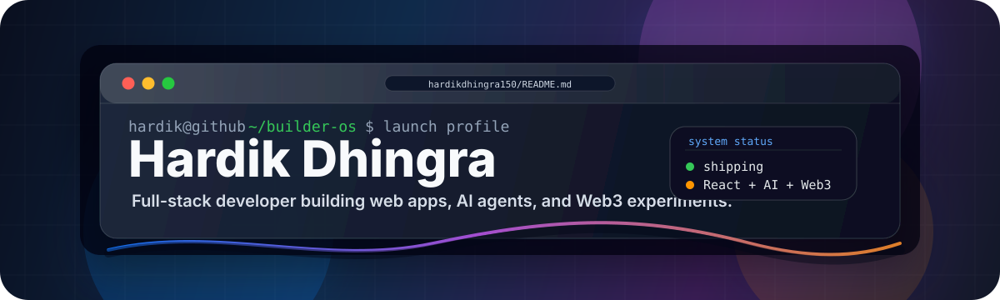
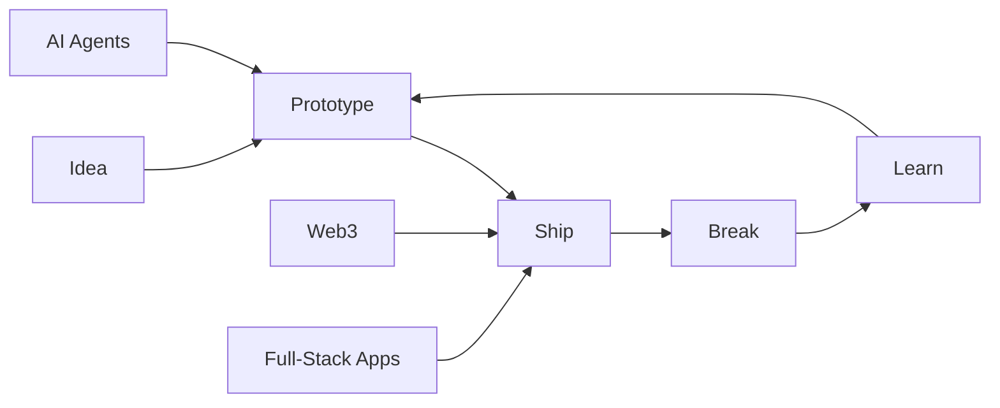

<p align="center">
  
</p>

<p align="center">
  <a href="https://hardikdhingra.online"></a>
  <a href="mailto:hardikdhingra150@gmail.com"></a>
  <a href="https://x.com/Hardikkkk10"></a>
</p>

<br />

```txt
Hardik Dhingra / builder profile
Location      Gurugram, Haryana, India
Mode          Full-stack developer
Focus         Web apps, AI agents, smart contracts
Personality   Curious, product-minded, late-night debugger
```

I am a developer who likes building things that feel usable, not just complete. My sweet spot is the space between clean frontends, practical backend logic, and new tech that is worth turning into real products.

I am currently exploring AI agents, Web3 systems, and full-stack product engineering. I care about shipping, learning in public, and writing code that my future self can still understand.

---

## Builder OS

| Layer | Tools I reach for |
| --- | --- |
| Interface | React, Tailwind CSS, JavaScript |
| Backend | Node.js, Firebase, MongoDB, SQL |
| Systems | C, C++, Java, Linux, Git |
| Web3 | Solidity, smart contracts, wallet flows |
| AI | LLM apps, agents, automation experiments |
| Workflow | Postman, GitHub, terminal, docs |

---

## Current Signal



I am especially interested in projects where the frontend, backend, and intelligence layer all matter. Dashboards, developer tools, automation systems, wallet-connected apps, and products with real user workflows are the kind of work that keeps me locked in.

---

## Tech Palette

<p align="center">
  
</p>

---

## Things I Like Building

```txt
01. Clean web apps with fast, readable interfaces
02. Authenticated dashboards and real product workflows
03. AI utilities that remove boring manual work
04. Smart-contract experiments and wallet-connected apps
05. Small open-source fixes that make someone else's day easier
```

---

## GitHub Console

<p align="center">
  
</p>

<p align="center">
  <a href="https://github.com/hardikdhingra150?tab=repositories"></a>
  <a href="https://github.com/hardikdhingra150?tab=overview"></a>
</p>

---

## Contact

The best conversations start with a project idea, a bug that refuses to behave, or a product that needs a sharper first version.

<p align="center">
  <a href="https://hardikdhingra.online"><strong>Portfolio</strong></a>
  &nbsp;/&nbsp;
  <a href="mailto:hardikdhingra150@gmail.com"><strong>Email</strong></a>
  &nbsp;/&nbsp;
  <a href="https://x.com/Hardikkkk10"><strong>X</strong></a>
</p>

<p align="center">
  <sub>Building in public, debugging in private, shipping whenever the build turns green.</sub>
</p>
