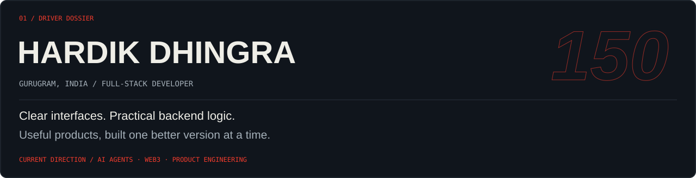
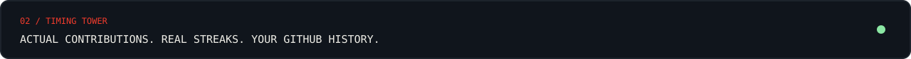
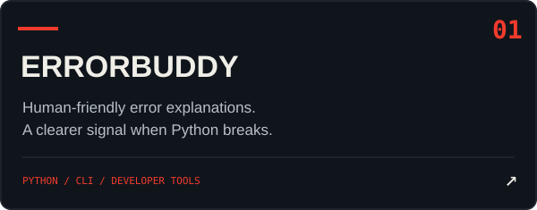
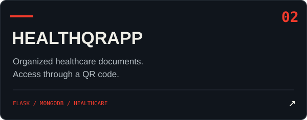
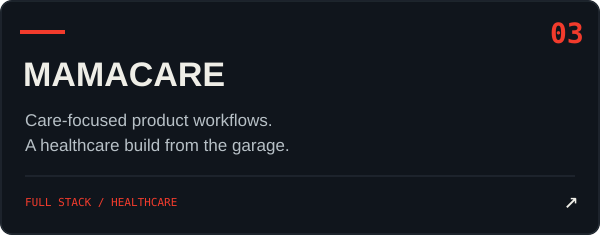
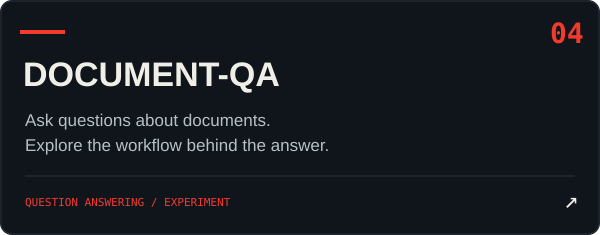
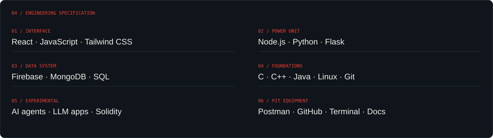
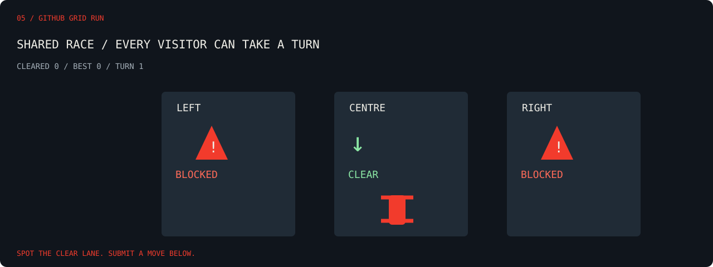

<a href="https://github.com/hardikdhingra150?tab=repositories"><strong>EXPLORE THE GARAGE ↗</strong></a> &nbsp; / &nbsp; <a href="mailto:hardikdhingra150@gmail.com"><strong>TEAM RADIO ↗</strong></a>

 

 

<a href="https://github.com/hardikdhingra150?tab=overview">Inspect the actual contribution calendar ↗</a>

 

### 03 / THE GARAGE

<table><tr>
<td width="50%"></td>
<td width="50%"></td>
</tr><tr>
<td></td>
<td></td>
</tr></table>

<a href="https://github.com/hardikdhingra150?tab=repositories">Full entry list →</a>

 

 

**Play here on GitHub:** spot the clear lane, choose below, then submit the prefilled issue. The race bot updates this board and closes your move issue. Refresh the README after the Action finishes.

<!-- RACE-CONTROLS:START -->

[◀ LEFT](https://github.com/hardikdhingra150/hardikdhingra150/issues/new?title=HD150%7C2%7Cleft&body=GitHub%20Grid%20Run%20move.%20Submit%20this%20issue%20to%20play.) &nbsp; / &nbsp; [◆ CENTRE](https://github.com/hardikdhingra150/hardikdhingra150/issues/new?title=HD150%7C2%7Ccentre&body=GitHub%20Grid%20Run%20move.%20Submit%20this%20issue%20to%20play.) &nbsp; / &nbsp; [RIGHT ▶](https://github.com/hardikdhingra150/hardikdhingra150/issues/new?title=HD150%7C2%7Cright&body=GitHub%20Grid%20Run%20move.%20Submit%20this%20issue%20to%20play.)

<!-- RACE-CONTROLS:END -->

One shared race, open to every signed-in visitor. Moves are turn-based and public. The board updates through GitHub Actions, so it is not instant. This game uses clicks; GitHub cannot run drag controls in a README.

 

<strong>YOUR IDEA. OUR NEXT LAP.</strong> A useful product, a difficult bug, or a first version worth building.

<a href="mailto:hardikdhingra150@gmail.com"><strong>EMAIL ↗</strong></a> &nbsp; / &nbsp; <a href="https://x.com/Hardikkkk10"><strong>X ↗</strong></a>

<code>hardikdhingra150@gmail.com</code>

