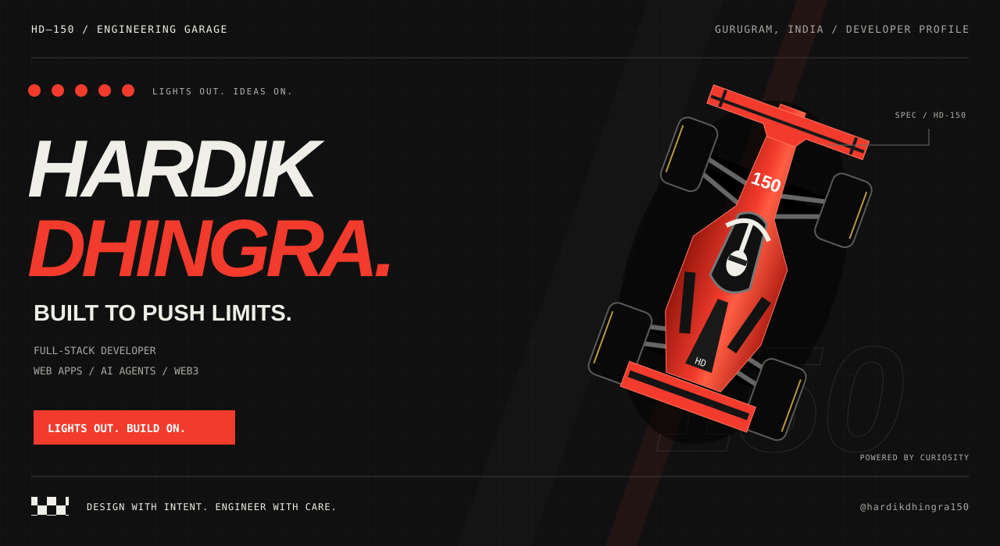
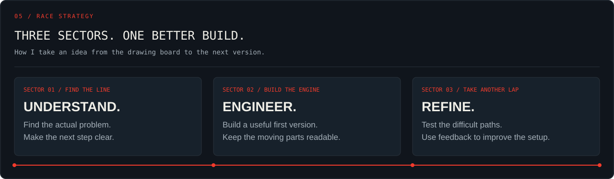

<!-- Upload this README and assets/ together. See INSTALL.md for the separate game. -->

  <a href="https://github.com/hardikdhingra150?tab=repositories"><strong>EXPLORE THE GARAGE ↗</strong></a>
  &nbsp; / &nbsp;
  <a href="https://hardikdhingra150.github.io/hardikdhingra150/"><strong>PLAY REDLINE / 150 ↗</strong></a>
  &nbsp; / &nbsp;
  <a href="mailto:hardikdhingra150@gmail.com"><strong>TEAM RADIO ↗</strong></a>

---

## 01 / Meet the driver

I like building things people can actually use: clear interfaces, practical backend logic, and workflows that make the next step easier.

My current playground is **full-stack product engineering, AI agents, and Web3**. I learn by shipping, understanding what breaks, and returning with a better setup.

> Build with ambition. Debug with patience. Let the work speak.

## 02 / Timing screen

Contributions are my laps. Consistency is the part I'm working on.

  

<a href="https://github.com/hardikdhingra150?tab=overview"><strong>Inspect the contribution calendar ↗</strong></a>

Live card powered by GitHub Readme Streak Stats. GitHub is the source for the contribution history.

## 03 / The garage

| Entry | What I'm building | Explore |
| :--- | :--- | :--- |
| **errorbuddy** | Friendlier Python error explanations and CLI hints. | [Code ↗](https://github.com/hardikdhingra150/errorbuddy) · [PyPI ↗](https://pypi.org/project/errorbuddy/) |
| **HealthQrApp** | Healthcare documents organized for access through a QR code. | [Code ↗](https://github.com/hardikdhingra150/HealthQrApp) |
| **MamaCare** | A full-stack healthcare project exploring care-focused workflows. | [Code ↗](https://github.com/hardikdhingra150/MamaCare) |
| **document-qa** | Experiments in question-answering workflows for documents. | [Code ↗](https://github.com/hardikdhingra150/document-qa) |

[**See every build →**](https://github.com/hardikdhingra150?tab=repositories)

## 04 / Under the bodywork

**INTERFACE** &nbsp; `React` `JavaScript` `Tailwind CSS`  
**ENGINE** &nbsp; `Node.js` `Python` `Flask`  
**DATA** &nbsp; `Firebase` `MongoDB` `SQL`  
**FOUNDATIONS** &nbsp; `C` `C++` `Java` `Linux` `Git`  
**R&D** &nbsp; `AI agents` `LLM apps` `Solidity` `Smart contracts`  
**PIT KIT** &nbsp; `Postman` `GitHub` `Terminal` `Docs`

---

 

## 05 / REDLINE — take the wheel

A separate, playable night-racing game. Drag the red car, dodge traffic, and beat your personal best. Touch and arrow keys work too.

**[🏁 Start your run ↗](https://hardikdhingra150.github.io/hardikdhingra150/)** · [Inspect the game source](./docs/index.html)

## 06 / Team radio

Have an idea worth building, a difficult bug, or a product that needs a better first version? Let's talk.

  <a href="mailto:hardikdhingra150@gmail.com"><strong>EMAIL ↗</strong></a>
  &nbsp; / &nbsp;
  <a href="https://x.com/Hardikkkk10"><strong>X ↗</strong></a>

<code>hardikdhingra150@gmail.com</code>

 

